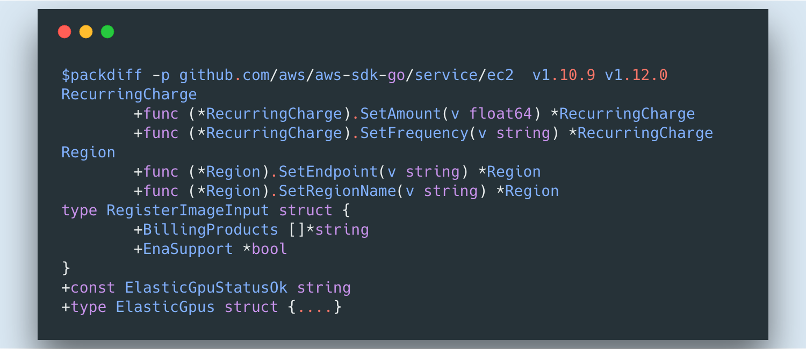

The tool allows to see changed/added/removed symbols between different versions of go programs.

Usage:
For Example to see changes from tagged version v1.10.9 to v1.12.0 of github.com/aws/aws-sdk-go/service/ec2:




Running: ```
packdiff -p package/name/from/GOPATH somethin1 something2```

The tool accepts option -p specifying the package and the two last arguments identifie the versions to compare. The last two arguments can be any commit sha, tag, or branch which are supplied to git checkout.
In case one tag is specified as in ,```
packdiff -p package/name/from/GOPATH something```, the first is assumed to be current state. 


The output corresponds to changes from the something1 to the something2.


To install:
```
go get -u github.com/duxum/packdiff
```


Contributions, recommendations and issues are welcome are welcome.


